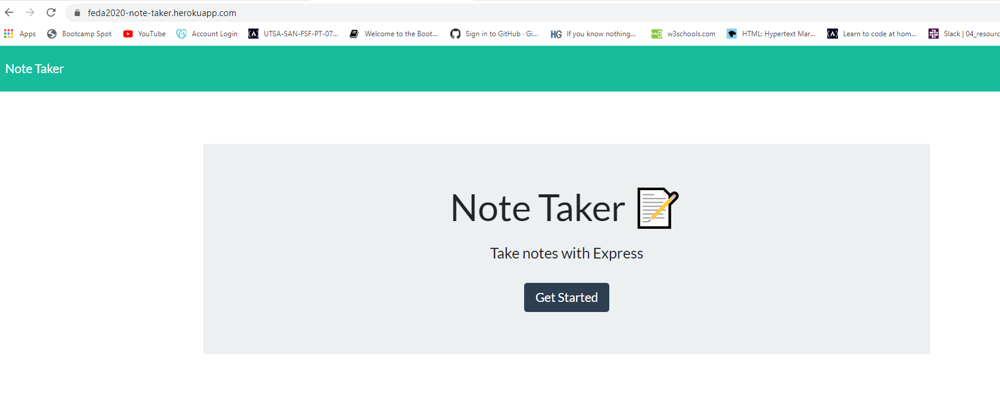

# HW11-Note-Taker

## Description

  The Note Taker application allows the user to write and store notes. The app also allow the user to delete the notes they don't need anymore.  

## Table of contents

* [Description](#Description)
* [Installation](#Installation)
* [Usage](#Usage)
* [Application walk through](#Application-walk-through)
* [Pictures](#Picture)
* [Test](#Test)
* [Questions](#Questions)

## Installation

  Installed node package and node express. 

## Usage

  As a busy student I want an application to write and organize my notes and  and I also need to be able to delete the notes I need anymore.

## Application-walk-through

 

 ## Picture

 
 

## Test

    Run the application on the localhost. 

## Questions
In case of any additional questions please visit my GitHub link: [Feda2020](https://github.com/Feda2020) 
Or don't hesitate to contact me via email: fido311@gmail.com
    